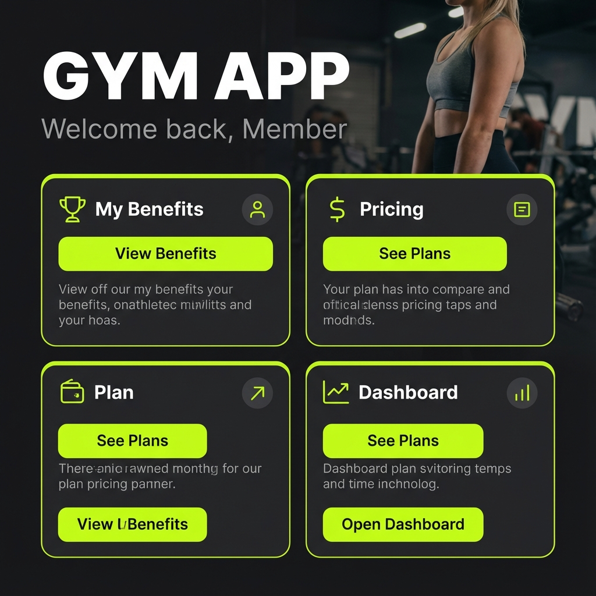
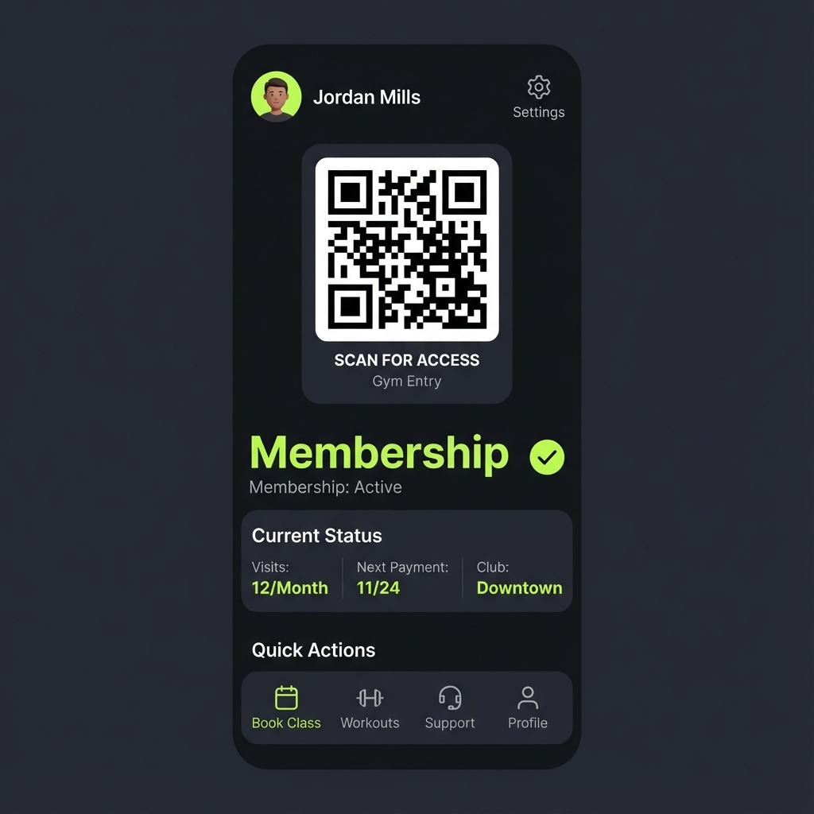
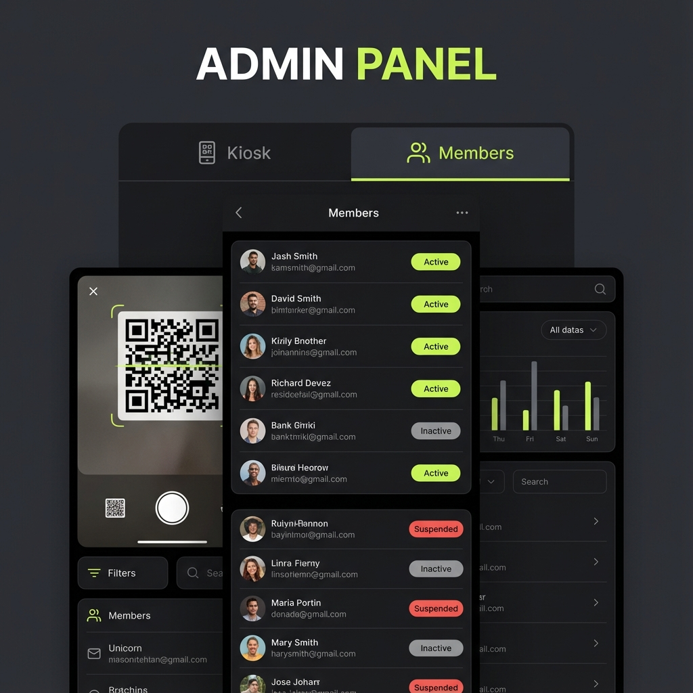

# 🏋️ Gym App Showcase

Welcome to the **Gym App** project! This is a modern, high-performance mobile application built with **React Native** and **Expo**, designed to streamline the gym experience for both members and administrators.

## 🚀 Project Overview

The Gym App provides a seamless digital interface for gym members to access facilities, view benefits, and manage their membership. For administrators, it offers a powerful set of tools to manage members and control access via QR code scanning.

## ✨ Key Features

### For Members
*   **📱 Member Dashboard**: A personalized hub displaying membership status and profile details.
*   **🔑 Digital Access**: Integrated QR code generation for easy gym entry.
*   **💎 Benefits & Pricing**: Clear overview of membership perks and pricing tiers.
*   **🎨 Modern UI**: sleek dark mode design with vibrant lime accents (`Zinc-950` & `Lime-400`).

### For Administrators
*   **🛡️ Admin Panel**: Secure area for staff to manage gym operations.
*   **📸 QR Scanner**: Built-in camera integration to scan member QR codes for check-ins.
*   **📋 Member Management**: Create, view, and manage member profiles.
*   **🖥️ Kiosk Mode**: Dedicated mode for front-desk check-ins.

## 🛠️ Technology Stack

*   **Framework**: [React Native](https://reactnative.dev/) & [Expo](https://expo.dev/)
*   **Styling**: [NativeWind](https://www.nativewind.dev/) (Tailwind CSS for React Native)
*   **Navigation**: React Navigation (Stack & Bottom Tabs)
*   **Icons**: Lucide React Native
*   **Backend/Auth**: Firebase Integration

## 📸 Visual Showcase

### Home Screen
The landing experience features a bold, energetic design that welcomes members and provides quick access to key features.



### Member Dashboard
A clean, functional dashboard where members can access their unique QR code for gym entry.



### Admin Panel
A powerful tool for staff to manage the roster and perform quick check-ins using the integrated scanner.



## 🏃 Getting Started

To run this project locally:

1.  **Install dependencies**:
    ```bash
    npm install
    ```

2.  **Start the server**:
    ```bash
    npx expo start
    ```

3.  **Run on device**:
    *   Scan the QR code with the Expo Go app (Android/iOS).
    *   Or press `i` for iOS Simulator / `a` for Android Emulator.

---
*Built with ❤️ using React Native*
